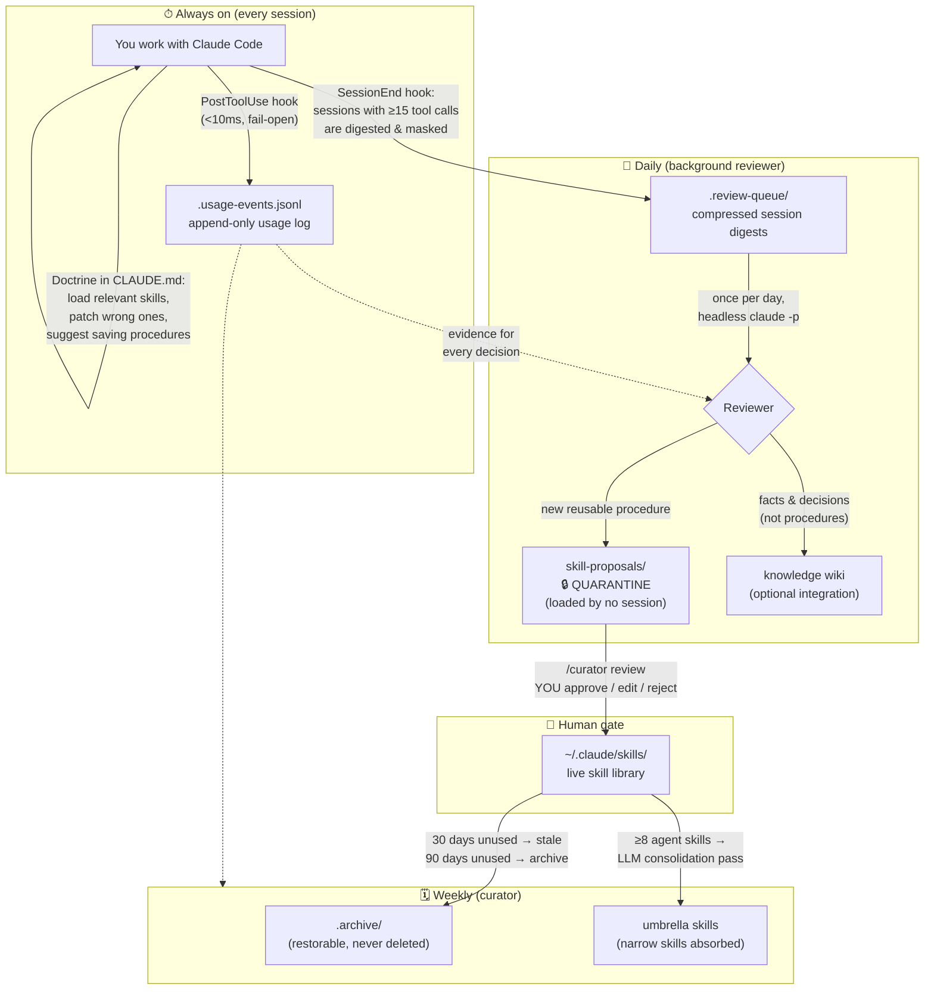
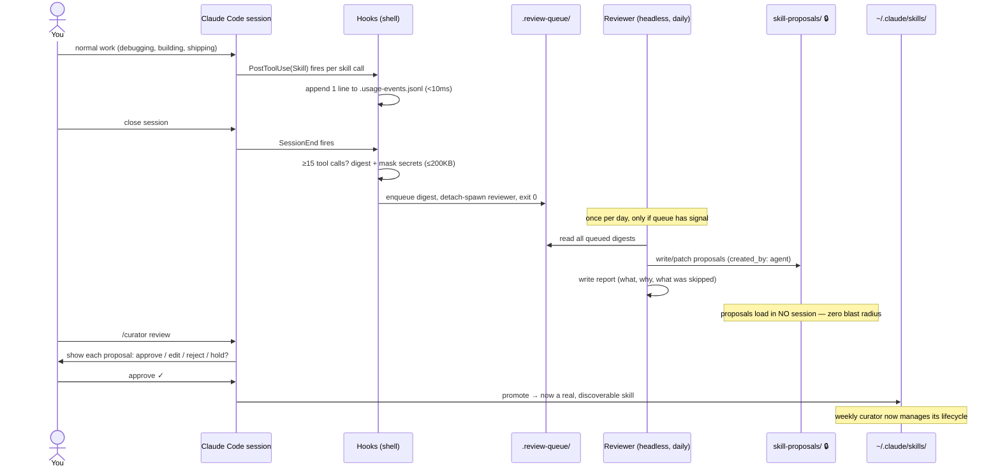
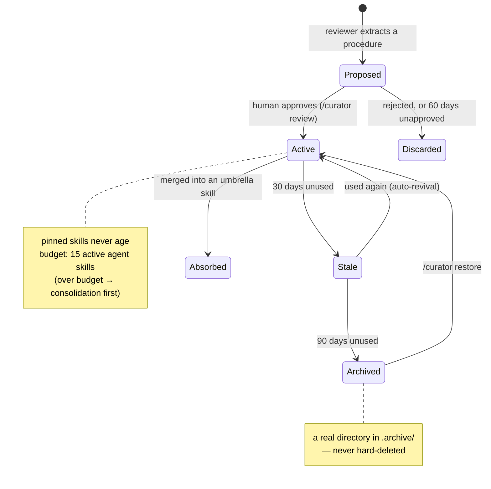
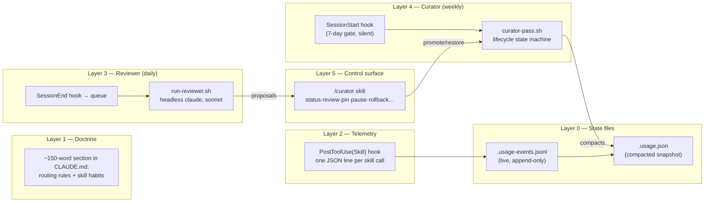

# Skill Factory & growing-skills

**Make Claude Code better every time you use it.** 🌱

growing-skills is a small, safe add-on for [Claude Code](https://claude.com/claude-code) that watches how you actually work, quietly drafts reusable "skills" from your real sessions, and asks **you** before any of them go live. Over weeks, your agent accumulates a personal library of procedures it learned from *your* work — and prunes the ones you stop using.

Inspired by [NousResearch's Hermes Agent](https://github.com/NousResearch/hermes-agent), rebuilt for Claude Code with stronger safety rails.

---

## What is this, in plain English?

Claude Code has **skills**: markdown files that teach the agent how to do something ("how we deploy", "how to fix this gnarly class of bug"). They're great — but writing and maintaining them by hand is a chore nobody keeps up with.

growing-skills closes that loop with four verbs:

| Verb | What happens | Who does it |
|---|---|---|
| 🧠 **Remember** | Every skill use is logged (a <10ms hook) | Automatic |
| ✍️ **Create** | A daily background reviewer reads digests of your sessions and drafts skill *proposals* | Automatic |
| ✅ **Approve** | Proposals sit in quarantine until you say yes | **Always you** |
| 🧹 **Retire** | Skills unused for 90 days get archived (never deleted) | Automatic, reversible |

Your hand-written skills are **never touched** — the system only manages skills it created itself.

## ⚡ Quick start (2 minutes)

You need: macOS or Linux, `bash`, [`jq`](https://jqlang.github.io/jq/), and Claude Code.

```bash
git clone https://github.com/buelmanager/skill-factory.git
cd skill-factory
bash growing-skills/install.sh
```

That's it. Open a new Claude Code session and just… work like you always do.

The installer is idempotent (safe to re-run), backs up your `settings.json` and `CLAUDE.md` before touching them, and there's a clean `uninstall.sh` that removes everything but preserves your data.

## Your first week

**Day 0 — install.** Nothing visible changes. Three lightweight hooks start running: one logs skill usage, one queues a masked digest when a substantial session (15+ tool calls) ends, one checks weekly whether maintenance is due. None of them can slow you down or block anything — every hook is fail-open and exits in milliseconds.

**Days 1–3 — it watches, you work.** The first time a day's queue contains real learning signal (errors you fought through, long tool chains, repeated procedures), the background reviewer runs — once per day, at most — and drafts proposals. If your sessions were routine, it does nothing at all.

**Day 3-ish — your first proposal.** Check in whenever you like:

```text
You:    /curator review

Claude: 1 pending proposal: fixing-vite-hmr-reload-loops
        "Use when Vite dev server enters an endless HMR reload loop…"
        proposed 2026-06-12 · source session a1b2c3
        → Approve / Edit then approve / Reject / Hold?

You:    approve

Claude: ✓ Promoted. It's now a live skill — future sessions will find it.
```

Until you approve, a proposal is loaded by **zero** sessions. Rejecting moves it to a discard folder (kept 14 days, in case you change your mind). Holding leaves it pending (auto-expires after 60 days).

**Week 2 and beyond — it tidies up.** Once a week the curator compacts the usage log, snapshots everything it manages, marks agent-skills unused for 30 days as *stale*, archives them at 90 days, and — once the library is big enough — merges clusters of narrow skills into broader "umbrella" skills so the library gets **better, not just bigger**. Every pass writes a human-readable report.

## Everyday commands

| Command | When you'd use it |
|---|---|
| `/curator` | "What's the state of things?" — counts, pending proposals, last run |
| `/curator review` | ★ Approve or reject pending skill proposals |
| `/curator pin <skill>` | "Never age this one out" |
| `/curator pause` / `resume` | Take a break from all automation |
| `/curator restore <skill>` | Bring a skill back from the archive |
| `/curator adopt <skill>` | Opt one of *your own* skills into lifecycle management |
| `/curator run` / `dry-run` | Run maintenance now / preview what it would do |
| `/curator rollback` | Restore the latest pre-maintenance snapshot (asks first) |

Force the daily reviewer to run right now:

```bash
GROWING_SKILLS_FORCE=1 bash ~/.claude/growing-skills/bin/run-reviewer.sh
```

## Is it safe? (the short version)

1. **Your skills are untouchable.** Lifecycle rules apply *only* to skills carrying a `created_by: agent` record — i.e., skills this system made. Hand-written skills aren't "protected by a rule"; they're outside the system's jurisdiction entirely.
2. **Nothing goes live without you.** Proposals are quarantined in a directory skill-discovery can't see. The human gate is the design, not an option.
3. **Nothing is ever hard-deleted.** Every removal is a move to an archive or discard folder. There is no delete code path. Plus a snapshot is taken before every maintenance pass — `/curator rollback` undoes it.
4. **Secrets are masked, three times.** Session digests are scrubbed of keys/tokens/passwords before any LLM sees them; the reviewer's prompt forbids credentials in any form; and you review everything before promotion.
5. **It can't run away.** Background LLM runs use a settings file with **zero hooks** (recursion is structurally impossible), single-instance locks, timeouts, and a once-per-day cap that skips entirely when there's nothing to learn.

The [full breaker table](#safety-design-the-full-table) below lists all 14 mechanisms.

## FAQ

**Will it eat my quota / cost me money?**
The reviewer runs headless `claude -p` (Sonnet) at most once per day, on compressed ≤200KB digests, and skips days with no signal. The curator's LLM pass only fires when you have 8+ agent-created skills, weekly at most. On subscription plans headless runs share your session quota — which is exactly why everything is batched and gated. Background spawns explicitly unset `ANTHROPIC_API_KEY` so they use your subscription, never silently billing an API account.

**Will it modify or delete my existing skills?**
No. See [Is it safe?](#is-it-safe-the-short-version) #1. If the reviewer notices a flaw in one of *your* skills, the most it does is mention it in a report for you to read.

**What if it learns something wrong?**
A wrong proposal influences nothing until promoted — that's the quarantine. The reviewer also carries a "do-not-learn" blacklist (environment-dependent failures, "tool X is broken" folklore, one-off stories, transient errors) so noise doesn't calcify into "knowledge" in the first place.

**How do I turn it off?**
Temporarily: `/curator pause`. Completely: `bash growing-skills/uninstall.sh` — removes hooks, settings entries, and the doctrine block, keeps all your data and skills.

**Where does my data go?**
Nowhere. Everything is plain local files under `~/.claude/` — JSONL logs, JSON sidecars, markdown reports. No server, no telemetry-to-anyone, no embeddings, no database.

**Does it manage project-local or plugin skills?**
No — global skills (`~/.claude/skills`) only. Plugin and project skills are filtered out at the telemetry layer. (A project-local loop is a v2 idea.)

**A proposal looks half-baked. What do I do?**
Say "edit then approve" in `/curator review` and shape it before promotion — or reject it. Quality over quantity is in the reviewer's prompt: it's explicitly told to propose *nothing* rather than something doubtful.

---

## How it works — the big picture

The system runs on **three time scales** — always-on doctrine, daily review, weekly curation:



A small "doctrine" block installed into `CLAUDE.md` routes each kind of knowledge to exactly one home:

| Knowledge type | Where it goes |
|---|---|
| **Procedures** ("how to do X") | Skills (`~/.claude/skills`) |
| **Facts, decisions, project context** | A knowledge wiki (optional integration) |
| **Episodes** (what happened) | Session transcripts — not written anywhere else |

### A day in the life



### The skill lifecycle

Only skills with `created_by: agent` (plus any of yours you explicitly `/curator adopt`) ever enter this state machine:



## Under the hood — architecture

Six layers, cheapest first. Each layer works without the ones above it.



**Layer 0 — State files.** Two files, deliberately split: hooks append to `.usage-events.jsonl` (atomic `O_APPEND` — parallel sessions can't corrupt it, no locks needed), and only the curator compacts it into `.usage.json`, the structured per-skill snapshot that is the **single evidence base for every automated decision**. (Hermes uses in-process file locks; for shell hooks, append-only + single-writer is more robust.)

**Layer 1 — Doctrine.** A short marker-fenced block in `~/.claude/CLAUDE.md`: load partially-relevant skills, patch a wrong skill the moment you catch it (and say so), suggest saving any 5+ tool-call procedure. The cheapest, highest-leverage piece — it half-works with no automation at all.

**Layer 2 — Telemetry.** `skill-telemetry.sh` on `PostToolUse(Skill)`: one appended line, <10ms, global skills only, **always exits 0** — metrics must never block real work.

**Layer 3 — Reviewer (daily).** Two stages: the `SessionEnd` hook (zero LLM calls) digests qualifying transcripts — real sessions run 3–13MB, compressed to ≤200KB of user messages, tool names, errors, and assistant gist, with secrets masked — and queues them. Then `run-reviewer.sh`, at most once per day, batches the queue into one headless `claude -p --model sonnet` run. **Why daily, not per-session?** Headless runs share your subscription session quota; a per-session reviewer can starve your actual work (we found this out the hard way when a 9-agent workflow died to "You've hit your session limit"). The reviewer follows a preference ladder (patch an existing proposal > fix a flawed agent skill > only then create new) and the do-not-learn blacklist. Output goes only to quarantine.

**Layer 4 — Curator (weekly).** A silent `SessionStart` hook spawns `curator-pass.sh` if 7+ days have passed. The pass: compact → snapshot (tar.gz, keeps 5) → deterministic 30/90-day transitions → 60-day proposal expiry → LLM consolidation (only at ≥8 active agent skills; the LLM writes **only to a staging directory** and emits a `moves.json` manifest that the *script* validates before applying — the LLM never moves files) → reference rewriting (agent-managed skills only) → report. The run timestamp is written *before* the pass (write-ahead) so a crash can't cause re-fire loops.

**Layer 5 — Control surface.** The `/curator` skill you saw above.

## Reference

### Data files

Everything lives under `~/.claude/`. Dot-prefixed paths are invisible to skill discovery — a fact verified by experiment, and the reason quarantine and archive work at all.

| Path | Purpose |
|---|---|
| `skills/.usage-events.jsonl` | Live append-only usage log (one line per skill call) |
| `skills/.usage.json` | Compacted per-skill state — the evidence base for all decisions |
| `skills/.review-queue/` | Masked session digests awaiting the daily reviewer |
| `skills/.review-reports/` | Reviewer run reports (keeps 12) |
| `skills/.curator_state` / `.reviewer_state` | Last-run timestamps (write-ahead) + pause flag |
| `skills/.curator.lock` / `.reviewer.lock` | Single-instance locks (atomic `noclobber`; auto-release after 2h) |
| `skills/.curator_reports/` | Curator pass reports (keeps 12) |
| `skills/.curator_backups/` | Pre-pass `tar.gz` snapshots of managed skills (keeps 5) |
| `skills/.curator_staging/` | The only place the consolidation LLM may write |
| `skills/.archive/<name>/` | Aged-out skills, fully restorable |
| `skill-proposals/<name>/` | 🔒 Quarantined proposals (`created_by: agent`, `proposed_at`, `source_session`) |
| `skill-proposals/.discarded/` | Rejected/expired proposals (kept 14 days) |
| `growing-skills/` | Installed package: `bin/`, `prompts/`, `settings/` |

### Configuration

| Variable | Default | Meaning |
|---|---|---|
| `GROWING_SKILLS_MIN_TOOLS` | `15` | Tool calls a session needs to be queued for review |
| `GROWING_SKILLS_CONSOLIDATE_MIN` | `8` | Active agent skills required before the consolidation pass runs |
| `GROWING_SKILLS_FORCE` | — | `1` bypasses the reviewer's once-per-day gate |
| `GROWING_SKILLS_BG` | — | Set by the system on its own background runs; hooks see it and exit |
| `GROWING_SKILLS_CLAUDE_DIR` | `~/.claude` | Install target override (used by tests) |
| `GROWING_SKILLS_NO_SPAWN` | — | `1` blocks detach-spawning (used by tests) |

Fixed by design (edit source if you must): 30-day stale / 90-day archive / 60-day proposal expiry / 15-skill budget / 200KB digest cap / 7-day curator period.

### What install/uninstall actually touch

`install.sh` (idempotent; backs up first): 3 hooks → `~/.claude/hooks/` + registrations merged into `settings.json` via validated `jq`; package → `~/.claude/growing-skills/` (`bin/`, `prompts/`, `settings/`); `/curator` skill → `~/.claude/skills/curator/`; doctrine block → `~/.claude/CLAUDE.md`.

`uninstall.sh`: removes all of the above — and **preserves all data** (logs, sidecar, archives, reports, proposals, and every skill).

### Safety design (the full table)

A self-improvement loop's failure mode is **error amplification**: a wrong lesson gets saved, loaded into future sessions, reinforced, multiplied. Each breaker cuts a specific link. Three are deliberate conservative deviations from Hermes:

1. **Proposal–promotion separation.** Hermes' reviewer installs skills directly; ours only proposes. Unpromoted = loaded nowhere = propagates nowhere.
2. **Inverted eligibility.** Managing "skills without usage records" would have *archived every pre-existing hand-made skill on the first pass* (they have no records!). Instead, only explicit `created_by: agent` entries are managed.
3. **Minimal auto-rewriting.** Reference rewriting touches agent-managed skills only; anything involving your files becomes a report checklist item.

| Breaker | Link it cuts |
|---|---|
| Proposal quarantine + human gate | Wrong lessons being loaded at all |
| Do-not-learn blacklist | Environment noise calcifying into "knowledge" |
| 60-day proposal expiry | Infinite proposal pileup |
| 15-skill index budget | Unbounded context pollution |
| Snapshot before every pass + archive-only removal | Irreversibility of any automated action |
| Reports for every run | Invisible automation |
| Daily batch + skip-when-no-signal | Reviewer eating your subscription quota |
| Headless spawns use `"hooks": {}` settings | Hook recursion — *structurally impossible*, not just guarded |
| `GROWING_SKILLS_BG=1` cooperative marker | Telemetry self-measurement loops (second line of defense) |
| Write-ahead timestamps + stale-lock release + `timeout` | Crash re-fire loops, deadlocks, process leaks |
| 3-layer secret defense: masking → blacklist → human review | Credentials baked into skills and replayed forever |
| LLM writes to staging only; script validates `moves.json` | A hallucinated consolidation deleting real skills |
| `env -u ANTHROPIC_API_KEY` on spawns | Background runs silently billing your API account |
| Every hook ends in `exit 0` | Telemetry ever blocking actual work |

### Repository layout

```
skill-factory/
├── README.md                  # you are here
├── growing-skills/            # the system itself (deployable package)
│   ├── install.sh             # idempotent installer
│   ├── uninstall.sh           # clean removal (preserves data)
│   ├── hooks/                 # 3 Claude Code hooks (telemetry, queue, curator trigger)
│   ├── bin/                   # digest, reviewer, compaction, curator pass, curator ctl
│   ├── prompts/               # reviewer + curator prompts (the "4 prompt texts")
│   ├── settings/              # headless-settings.json ({"hooks": {}})
│   ├── doctrine/              # the CLAUDE.md doctrine block
│   └── skill/                 # the /curator control skill
├── docs/superpowers/
│   ├── specs/                 # design documents (Korean)
│   └── plans/                 # phase-by-phase TDD implementation plans (Korean)
├── templates/                 # SKILL.md template for hand-writing skills
├── test-scenarios/            # pressure-test scenario template (RED/GREEN/REFACTOR)
└── tests/                     # 9 bash test suites, ~150 assertions
```

> **Note on language:** design docs and plans under `docs/` are in Korean (the author's working language). This README is the canonical English overview; the code and prompts are self-contained.

## Why this exists (the story)

[Hermes Agent](https://github.com/NousResearch/hermes-agent) demonstrated that an agent can run a skill-growth loop itself. We analyzed its source in depth (a 7-agent parallel analysis, 257 tool calls, adversarially cross-checked) and found the essence is remarkably simple:

> **The whole self-growth loop is: 4 prompt texts + 1 append-only JSON sidecar file + file moves.**
> No embeddings. No daemon. No ML pipeline. Skill "search" is just the LLM reading a name+description index.

Even better, Hermes' skill format intentionally mirrors Claude's (its source cites Anthropic's 64/1024-character frontmatter limits), so nothing needed converting. What *did* need changing was safety: a loop that learns from its own output can amplify its own mistakes — hence the quarantine, the inverted eligibility, and archive-only removal described above.

**Deliberately not ported:** Hermes' `insights` stats command (unrelated to learning), hard deletion in the LLM pass (`rmtree` — archive semantics are safer), and `prune_builtins` (which curates even pre-existing skills — too dangerous).

## The Skill Factory workflow (TDD for hand-written skills)

This repo doubles as a workspace for *hand-crafting* skills, governed by one rule:

> **The Iron Law: no skill without a failing test first.**

Skill writing is TDD applied to process documentation — you first prove the agent *fails without the skill*:

1. **RED — baseline failure.** Write a pressure scenario in `test-scenarios/` (for discipline skills, stack 3+ pressures: time pressure, sunk cost, authority, fatigue). Run a subagent through it *without* the skill. Record its choices and rationalizations *verbatim*.
2. **GREEN — minimal skill.** Copy `templates/SKILL-template.md`; write the *minimum* content addressing the recorded failures. Re-run the scenario *with* the skill; confirm it passes.
3. **REFACTOR — close loopholes.** Every new rationalization the agent invents gets an explicit counter (rationalization table, red-flag list). Re-test until clean.

The automated pipeline meets the same bar: `/curator review` can route a proposal through a pressure test before promotion.

Distilled writing rules: lowercase-hyphen verb names (`creating-skills`); description starts "Use when…" and states *triggering conditions only* (summarize the workflow there and agents will follow the summary instead of reading the body); frontmatter ≤1024 chars; search keywords (error messages, symptoms, tool names) through the body; ≤500 words for normal skills.

## Testing

```bash
for t in tests/test-*.sh; do bash "$t"; done
```

Nine suites, ~150 assertions: telemetry hook behavior (including path-traversal guards), digestion and secret masking (fake keys as fixtures), queue gating, reviewer locking/gating/isolation, event compaction, curator lifecycle transitions, the curator CLI, installer idempotency, and uninstall safety (e.g., marker-pair validation that prevents a corrupted sed range from eating your `CLAUDE.md`).

Real defects these tests caught during development: a skill name containing `../` could escape the skills directory (now guarded), and an uninstall with a missing end-marker would have truncated `CLAUDE.md` to EOF (now validated).

## Roadmap

- **Lifecycle dashboard** *(designed, not yet implemented — specs in `docs/`)*: a single self-contained HTML file (bash + jq, zero dependencies, works from `file://`) showing the whole pipeline — usage heatmap, aging against the 30/90-day lines, and a per-skill provenance panel answering "why was this skill born, how did it grow, why did it die."
- **Promotion gate tuning**: should pressure-testing be mandatory before promotion? Deciding from dogfooding friction.
- **Project-local loop** (v2 candidate): the same lifecycle for per-project `.claude/skills`.

## Origins and credits

- **[NousResearch / hermes-agent](https://github.com/NousResearch/hermes-agent)** — the proof that a skill-growth loop needs no heavy machinery. The preference ladder and do-not-learn blacklist come from its `background_review.py`; umbrella consolidation and the 30/90-day lifecycle from its `curator.py`; the doctrine from its `SKILLS_GUIDANCE`.
- **[Anthropic Claude Code](https://claude.com/claude-code)** — the host platform; everything here is built from its native extension points (hooks, skills, headless mode, settings overrides).
- The skill-writing methodology builds on the `superpowers:writing-skills` discipline (baseline-first, pressure scenarios, rationalization tables).

---

*Built with Claude Code, reviewed by humans — which is rather the whole point.* 🌱
