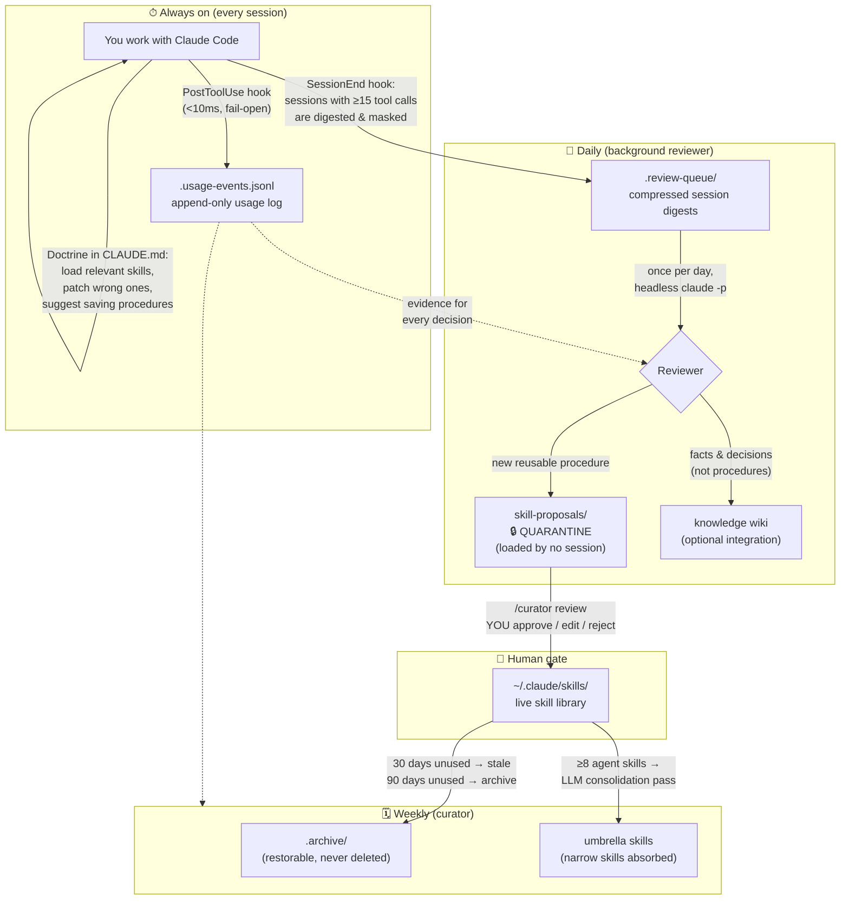
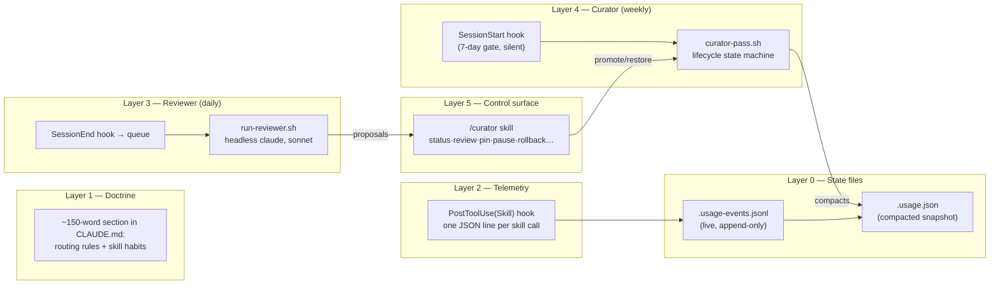
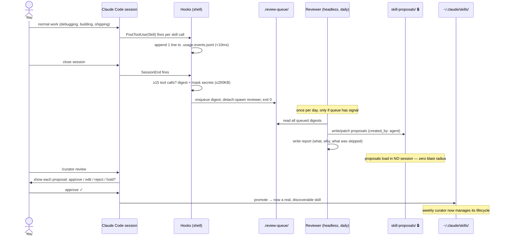
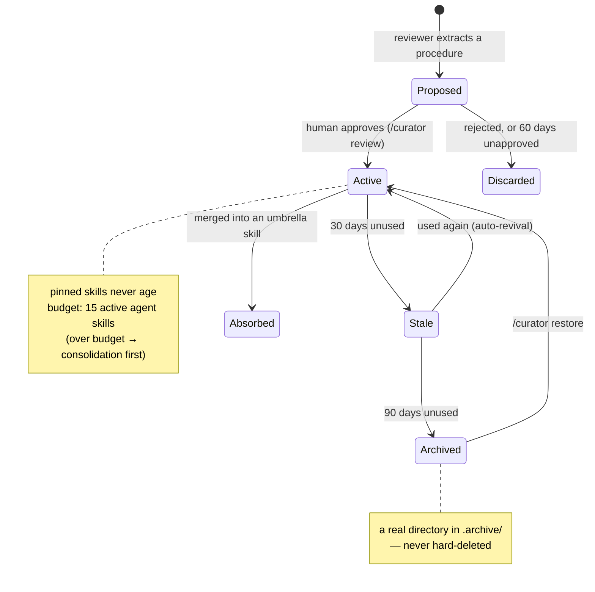

# Skill Factory & growing-skills

**A self-growing skill system for Claude Code** — your agent remembers which skills it uses, learns new skills from its own work sessions, consolidates them as they accumulate, and retires the ones it stops using. Inspired by [NousResearch's Hermes Agent](https://github.com/NousResearch/hermes-agent), rebuilt for Claude Code with stronger safety rails.

> **TL;DR** — Install three lightweight shell hooks and Claude Code becomes an agent that *gets better the more you use it*. Every session is silently digested; a daily background reviewer proposes new reusable skills from what actually happened; **you approve every promotion**; a weekly curator archives what goes stale. Nothing is ever hard-deleted, and your hand-written skills are structurally untouchable.

---

## Table of Contents

- [Why this exists](#why-this-exists)
- [Who this is for](#who-this-is-for)
- [Goals and non-goals](#goals-and-non-goals)
- [The big picture: the growth loop](#the-big-picture-the-growth-loop)
- [How it works — architecture](#how-it-works--architecture)
- [A day in the life](#a-day-in-the-life)
- [The skill lifecycle](#the-skill-lifecycle)
- [Installation](#installation)
- [Usage — the `/curator` command](#usage--the-curator-command)
- [Data files reference](#data-files-reference)
- [Configuration](#configuration)
- [Safety design](#safety-design)
- [Repository layout](#repository-layout)
- [The Skill Factory workflow (TDD for skills)](#the-skill-factory-workflow-tdd-for-skills)
- [Testing](#testing)
- [Roadmap](#roadmap)
- [Origins and credits](#origins-and-credits)

---

## Why this exists

Claude Code supports **skills** — markdown documents (`SKILL.md`) that teach the agent reusable procedures. They work beautifully, but they have a human bottleneck: *somebody* has to notice that a procedure is worth saving, write it down well, keep it accurate, and clean it up when it goes stale. In practice nobody does this consistently, so skill libraries either stagnate or rot.

[Hermes Agent](https://github.com/NousResearch/hermes-agent) demonstrated that an agent can run this loop itself. We analyzed its source in depth (a 7-agent parallel analysis, 257 tool calls, adversarially cross-checked) and found that the essence is remarkably simple:

> **The whole self-growth loop is: 4 prompt texts + 1 append-only JSON sidecar file + file moves.**
> No embeddings. No daemon. No ML pipeline. Skill search is just the LLM reading a name+description index.

Even better: Hermes' skill format intentionally mirrors Claude's (its source code cites Anthropic's 64/1024-character frontmatter limits), so no format conversion is needed.

This repository ports that loop to Claude Code as **growing-skills** — and makes it deliberately more conservative in three ways (see [Safety design](#safety-design)), because a loop that learns from its own output can also *amplify its own mistakes* if you let it.

## Who this is for

| Persona | What you get |
|---|---|
| **The heavy Claude Code user** — you live in the CLI daily and keep solving the same classes of problems | Your repeated procedures crystallize into skills automatically. You just review and approve proposals once in a while. |
| **The skill library maintainer** — you already curate `~/.claude/skills` by hand | Usage telemetry tells you what's actually loaded; the curator flags what's stale; consolidation keeps the index small. Your hand-made skills are never touched. |
| **The agent-systems tinkerer** — you want to study a working self-improvement loop | A complete, tested, ~small-shell-scripts implementation of memory → proposal → human gate → lifecycle management, with every design decision documented and its rationale recorded. |
| **The cautious engineer** — you like the idea but fear automated self-modification | Every breaker that prevents error amplification is explicit and listed. Proposals are quarantined until a human approves. Nothing is hard-deleted. Everything is reversible. |

## Goals and non-goals

**Goals**

1. **Remember** — record which skill was used when, with zero friction (an append-only log written by a <10ms hook).
2. **Create** — extract reusable procedures from real sessions and turn them into *proposals* (never directly into live skills).
3. **Evolve** — patch incorrect skills on the spot; merge clusters of narrow skills into class-level "umbrella" skills so the library gets *better*, not just bigger.
4. **Retire** — archive (never delete) skills that go unused, keeping the skill index small and healthy.

**Non-goals**

- **No autonomous self-modification of your skills.** Agent-proposed skills live in quarantine until you promote them. Hand-written skills are structurally outside the system's authority.
- **No embeddings, no vector DB, no daemon.** The entire state is plain JSON/JSONL files plus directories. Search is the LLM reading an index.
- **No statistics theater.** Hermes' `insights` command (usage stats unrelated to learning) was deliberately not ported.
- **No hard deletion.** Hermes' LLM pass can `rmtree` skills; ours can only move them to an archive folder.

## The big picture: the growth loop

The system runs on **three time scales** — always-on doctrine, daily review, weekly curation:



Knowledge is routed by type so each lesson lands in exactly one place (this is the "doctrine" installed into `CLAUDE.md`):

| Knowledge type | Where it goes |
|---|---|
| **Procedures** ("how to do X") | Skills (`~/.claude/skills`) |
| **Facts, decisions, project context** | A knowledge wiki (optional integration) |
| **Episodes** (what happened) | Session transcripts — not written anywhere else |

## How it works — architecture

Six layers, from cheapest to most automated. Each layer works without the ones above it.



### Layer 0 — State files

Two files, deliberately split:

- **`.usage-events.jsonl`** — the live log. Hooks append one line per skill call (`{ts, skill, event, session}`). `O_APPEND` writes are atomic, so parallel sessions never corrupt it. No locks needed.
- **`.usage.json`** — the structured snapshot (per-skill: use count, last activity, state, `created_by`, pinned…). Only the curator writes it, during compaction. This is the **single evidence base for every automated decision**.

Why split? Concurrent sessions doing read-modify-write on one JSON file is a race. Hermes solves it with in-process file locks; for shell hooks, append-only + single-writer-compaction is more robust.

### Layer 1 — Doctrine

A short block installed into `~/.claude/CLAUDE.md` (idempotent, marker-fenced). It teaches every session: load partially-relevant skills, patch a skill the moment you find it wrong (and tell the user), and after any 5+ tool-call task, suggest saving the procedure as a skill. **This is the cheapest, highest-leverage piece — it half-works even with no automation at all.**

### Layer 2 — Telemetry hook

`skill-telemetry.sh` fires on `PostToolUse` with a `Skill` matcher. It appends one line to the events log and exits. Key properties: only global skills are counted (plugin/project skills are filtered out by path), it targets <10ms, and **it always exits 0** — telemetry must never block real work (fail-open).

### Layer 3 — Background reviewer (daily)

Two stages, by design:

1. **`SessionEnd` hook (zero LLM calls):** if the session used ≥15 tools, the transcript (real-world size: 3–13 MB) is compressed to a ≤200KB digest — user messages, tool names, errors, assistant gist — with **secret patterns masked** (API keys, tokens, JWTs, passwords, connection strings). The digest is queued. The hook detach-spawns the reviewer and exits, never delaying session close.
2. **`run-reviewer.sh` (at most once per day):** batches queued digests into a headless `claude -p --model sonnet` run with a dedicated reviewer prompt. **Why daily batch instead of per-session?** On subscription plans, headless `claude -p` shares your interactive session quota — a per-session reviewer can starve your real work. (We learned this empirically: a 9-agent verification workflow once died entirely to "You've hit your session limit".) If the queue has no learning signal, the day's run is skipped outright.

The reviewer follows a **preference ladder** (ported from Hermes): patch an existing related proposal > fix a flawed agent-created skill > only then create a new proposal. And a **do-not-learn blacklist**: environment-dependent failures, "tool X is broken" claims (these calcify into self-blocking superstitions), transient errors, one-off narratives, guesses — and *never* credentials in any form.

Its output goes to `~/.claude/skill-proposals/` — a quarantine directory that skill discovery never sees. **A proposal influences zero sessions until you promote it.**

### Layer 4 — Curator (weekly)

A silent `SessionStart` hook checks a timestamp; if 7+ days have passed, it detach-spawns `curator-pass.sh`. The pass, in order:

1. **Compact** the events log into `.usage.json` (and rotate the log).
2. **Snapshot** all agent-managed skills + sidecar to a `tar.gz` (keeps 5) — every later step is reversible.
3. **Lifecycle transitions** (deterministic, no LLM): for skills with `created_by: agent` only — 30 days unused → `stale`, 90 days → moved to `.archive/`. **There is no hard-delete code path.**
4. **Proposal hygiene:** proposals unapproved for 60 days are auto-discarded (to `.discarded/`, kept 14 more days).
5. **LLM consolidation pass** (only when ≥8 active agent skills): clusters of narrow skills are merged into umbrella skills. The LLM writes **only to a staging directory** and must emit a `moves.json` manifest; the *script* validates every entry (each `from` must exist, each `into` must be real) before applying anything. The LLM never moves files itself.
6. **Reference rewriting** inside agent-managed skills only; references in *your* files are merely listed in the report.
7. **Report** to `.curator_reports/<date>.md` (keeps 12) — every automated action is human-visible.

The timestamp is written **before** the pass starts (write-ahead): if the pass crashes, it won't re-fire on every new session.

### Layer 5 — Control surface

The `/curator` skill — see [Usage](#usage--the-curator-command).

## A day in the life



## The skill lifecycle

Only skills with `created_by: agent` in the sidecar (i.e., skills this system itself created) — plus any user skill you explicitly opt in via `/curator adopt` — are ever subject to lifecycle management. **Everything else is structurally invisible to the curator.**



## Installation

**Requirements:** macOS or Linux, `bash`, [`jq`](https://jqlang.github.io/jq/), and [Claude Code](https://claude.com/claude-code) (the reviewer/curator spawn headless `claude -p`, which on subscription plans shares your session quota — the daily/weekly gates exist precisely to keep that negligible).

```bash
git clone https://github.com/buelmanager/skill-factory.git
cd skill-factory
bash growing-skills/install.sh
```

What `install.sh` actually does (idempotent — safe to re-run; backs up `settings.json` and `CLAUDE.md` first):

| Target | What |
|---|---|
| `~/.claude/hooks/` | 3 hook scripts (telemetry, session-end queue, session-start curator) |
| `~/.claude/settings.json` | 3 hook registrations merged in via `jq` (validated before replacing) |
| `~/.claude/growing-skills/` | `bin/` (5 scripts), `prompts/` (reviewer + curator), `settings/headless-settings.json` |
| `~/.claude/skills/curator/` | the `/curator` control skill |
| `~/.claude/CLAUDE.md` | the doctrine block (marker-fenced) |

New sessions pick everything up automatically. To remove:

```bash
bash growing-skills/uninstall.sh
```

Uninstall removes hooks, settings entries, the doctrine block, the `/curator` skill, and the package directory — but **preserves all data** (usage logs, archives, reports, proposals, and of course your skills).

## Usage — the `/curator` command

Inside any Claude Code session:

| Command | What it does |
|---|---|
| `/curator` or `/curator status` | Active agent skills vs. budget, stale count, pending proposals, last pass time, latest report summary |
| `/curator review` | ★ **The promotion gate.** Shows each pending proposal; you approve / edit-then-approve / reject / hold |
| `/curator run` | Run a curator pass now (in the background — consolidation can take up to 15 minutes) |
| `/curator dry-run` | Show what a pass *would* do, writing nothing |
| `/curator pin <skill>` / `unpin <skill>` | Exempt a skill from aging entirely |
| `/curator pause` / `resume` | Suspend / resume all automatic curation |
| `/curator restore <skill>` | Bring a skill back from `.archive/` |
| `/curator adopt <skill>` | Opt one of *your* skills into 30/90-day lifecycle management |
| `/curator rollback` | Restore the latest pre-pass snapshot (always asks you first) |

Manual reviewer run (bypasses the daily gate):

```bash
GROWING_SKILLS_FORCE=1 bash ~/.claude/growing-skills/bin/run-reviewer.sh
```

## Data files reference

Everything lives under `~/.claude/`. Dot-prefixed paths are invisible to skill discovery — that fact (verified by experiment, not assumption) is what makes quarantine and archive work.

| Path | Purpose |
|---|---|
| `skills/.usage-events.jsonl` | Live append-only usage log (one line per skill call) |
| `skills/.usage.json` | Compacted per-skill state — the evidence base for all decisions |
| `skills/.review-queue/` | Masked session digests awaiting the daily reviewer |
| `skills/.review-reports/` | Reviewer run reports (keeps 12) |
| `skills/.curator_state` / `.reviewer_state` | Last-run timestamps (write-ahead) + pause flag |
| `skills/.curator.lock` / `.reviewer.lock` | Single-instance locks (atomic `noclobber`; auto-released after 2h if stale) |
| `skills/.curator_reports/` | Curator pass reports (keeps 12) |
| `skills/.curator_backups/` | Pre-pass `tar.gz` snapshots of managed skills (keeps 5) |
| `skills/.curator_staging/` | The only place the consolidation LLM may write |
| `skills/.archive/<name>/` | Aged-out skills, fully restorable |
| `skill-proposals/<name>/` | 🔒 Quarantined proposals (`created_by: agent`, `proposed_at`, `source_session` in frontmatter) |
| `skill-proposals/.discarded/` | Rejected/expired proposals (kept 14 days) |
| `growing-skills/` | Installed package: `bin/`, `prompts/`, `settings/` |

## Configuration

All thresholds are environment-variable overridable (mostly useful for testing):

| Variable | Default | Meaning |
|---|---|---|
| `GROWING_SKILLS_MIN_TOOLS` | `15` | Tool calls a session needs to be queued for review |
| `GROWING_SKILLS_CONSOLIDATE_MIN` | `8` | Active agent skills required before the LLM consolidation pass runs |
| `GROWING_SKILLS_FORCE` | — | `1` bypasses the reviewer's once-per-day gate |
| `GROWING_SKILLS_BG` | — | Set to `1` by the system on its own background runs; hooks see it and exit immediately |
| `GROWING_SKILLS_CLAUDE_DIR` | `~/.claude` | Install target override (used by the test suite) |
| `GROWING_SKILLS_NO_SPAWN` | — | `1` blocks detach-spawning (used by the test suite) |

Hard-coded by design (change in source if you must): 30-day stale / 90-day archive / 60-day proposal expiry / 15-skill budget / 200KB digest cap / 7-day curator period.

## Safety design

A self-improvement loop's failure mode is **error amplification**: a wrong lesson gets saved, loaded into future sessions, reinforced, and multiplied. Every breaker below exists to cut a specific link in that chain. Three are deliberate *conservative deviations from Hermes*:

1. **Proposal–promotion separation (probation).** Hermes' reviewer installs skills directly; ours only proposes. An unpromoted skill is loaded by zero sessions, so a wrong lesson propagates exactly nowhere.
2. **Inverted eligibility.** The curator doesn't manage "skills without usage records" (which would have *archived every pre-existing hand-made skill on first run* — they have no records!). It manages only skills with an explicit `created_by: agent` entry. Your skills aren't protected by a rule; they're outside the system's jurisdiction entirely.
3. **Minimal auto-rewriting.** Automatic reference rewriting touches agent-managed skills only. Anything involving your files becomes a checklist item in a report.

The full breaker table:

| Breaker | Link it cuts |
|---|---|
| Proposal quarantine + human gate | Wrong lessons being loaded at all |
| Do-not-learn blacklist | Environment noise calcifying into "knowledge" |
| 60-day proposal expiry | Infinite proposal pileup |
| 15-skill index budget | Unbounded context pollution |
| Snapshot before every pass + archive-only removal | Irreversibility of any automated action |
| Reports for every run | Invisible automation |
| Daily batch + skip-when-no-signal | Reviewer eating your subscription quota |
| Headless spawns use a settings file with `"hooks": {}` | Hook recursion — *structurally impossible*, not just guarded (a future hook that forgets the env-var check still can't recurse) |
| `GROWING_SKILLS_BG=1` cooperative marker | Telemetry self-measurement loops (second line of defense) |
| Write-ahead timestamps + stale-lock auto-release + `timeout` wrappers | Crash → re-fire loops, deadlocks, process leaks |
| 3-layer secret defense: digest masking → reviewer blacklist → human review | A credential getting baked into a skill and replayed into every future session |
| LLM writes to staging only; script validates `moves.json` before applying | A hallucinated consolidation deleting real skills |
| `env -u ANTHROPIC_API_KEY` on spawns | Background runs silently billing your API account instead of using subscription auth |
| Every hook ends in `exit 0` | Telemetry ever blocking actual work |

## Repository layout

```
skill-factory/
├── README.md                  # you are here
├── growing-skills/            # the system itself (deployable package)
│   ├── install.sh             # idempotent installer
│   ├── uninstall.sh           # clean removal (preserves data)
│   ├── hooks/                 # 3 Claude Code hooks (telemetry, queue, curator trigger)
│   ├── bin/                   # digest, reviewer, compaction, curator pass, curator ctl
│   ├── prompts/               # reviewer + curator prompts (the "4 prompt texts")
│   ├── settings/              # headless-settings.json ({"hooks": {}})
│   ├── doctrine/              # the CLAUDE.md doctrine block
│   └── skill/                 # the /curator control skill
├── docs/superpowers/
│   ├── specs/                 # design documents (Korean)
│   └── plans/                 # phase-by-phase TDD implementation plans (Korean)
├── templates/                 # SKILL.md template for hand-writing skills
├── test-scenarios/            # pressure-test scenario template (RED/GREEN/REFACTOR)
└── tests/                     # 9 bash test suites, ~150 assertions
```

> **Note on language:** the design docs and plans under `docs/` are written in Korean (the author's working language). This README is the canonical English overview; the code and prompts are self-contained.

## The Skill Factory workflow (TDD for skills)

This repo is also a workspace for *hand-crafting* skills, governed by one rule:

> **The Iron Law: no skill without a failing test first.**

Writing a skill is TDD applied to process documentation. You don't write the skill and then check it works — you first prove the agent *fails without it*:

1. **RED — baseline failure.** Write a pressure scenario in `test-scenarios/` (for discipline-type skills, combine 3+ pressures: time pressure, sunk cost, authority, fatigue). Run a subagent through it *without* the skill. Record its choices and its rationalizations *verbatim*.
2. **GREEN — minimal skill.** Copy `templates/SKILL-template.md` and write the *minimum* content that addresses the recorded failures. Re-run the same scenario *with* the skill; confirm it passes.
3. **REFACTOR — close the loopholes.** Every new rationalization the agent invents during testing gets an explicit counter (a rationalization table, red-flag list). Re-test until clean.

This is the same gate offered to agent-proposed skills: `/curator review` can optionally route a proposal through a pressure test before promotion. The hand-crafted pipeline and the automated pipeline meet at the same quality bar.

Writing rules distilled into the template: name in lowercase-hyphen verb form (`creating-skills`); description starts with "Use when…" and states *triggering conditions only* (if you summarize the workflow there, agents follow the summary and never read the body); frontmatter ≤1024 chars; search keywords (error messages, symptoms, tool names) scattered through the body; ≤500 words for normal skills.

## Testing

```bash
for t in tests/test-*.sh; do bash "$t"; done
```

Nine suites, ~150 assertions, covering: telemetry hook behavior (including path traversal guards), transcript digestion and secret masking (fake keys as fixtures), queue gating, reviewer locking/gating/isolation, event compaction, curator lifecycle transitions, curator CLI, hook installation idempotency, and uninstall safety (e.g., the marker-pair validation that prevents a corrupted sed range from eating your `CLAUDE.md`).

Real defects these tests caught during development: a skill name containing `../` could escape the skills directory (now guarded), and an uninstall with a missing end-marker would have deleted `CLAUDE.md` to EOF (now validated).

## Roadmap

- **Lifecycle dashboard** *(designed, not yet implemented — specs in `docs/`)*: a single self-contained HTML file (bash + jq, no dependencies, works from `file://`) rendering the full pipeline — usage heatmap, aging view against the 30/90-day thresholds, and a per-skill provenance panel answering "why was this skill born, how did it grow, why did it die." Backed by a planned `.lifecycle-events.jsonl` append-only reasons log.
- **Promotion gate tuning**: deciding whether pressure-testing should be mandatory (vs. optional) for promotion, based on dogfooding friction.
- **Project-local loop** (v2 candidate): extending the same lifecycle to per-project `.claude/skills`.

## Origins and credits

- **[NousResearch / hermes-agent](https://github.com/NousResearch/hermes-agent)** — the proof that a skill-growth loop needs no heavy machinery. The reviewer's preference ladder and do-not-learn blacklist are ported from its `background_review.py`; the umbrella-consolidation concept and 30/90-day lifecycle from its `curator.py`; the doctrine from its `SKILLS_GUIDANCE`. Deviations (quarantine, inverted eligibility, archive-only) are deliberate and documented above.
- **[Anthropic Claude Code](https://claude.com/claude-code)** — the host platform; the whole system is built from its native extension points (hooks, skills, headless mode, settings overrides).
- The skill-writing methodology builds on the `superpowers:writing-skills` discipline (baseline-first, pressure scenarios, rationalization tables).

---

*Built with Claude Code, reviewed by humans — which is rather the whole point.*
